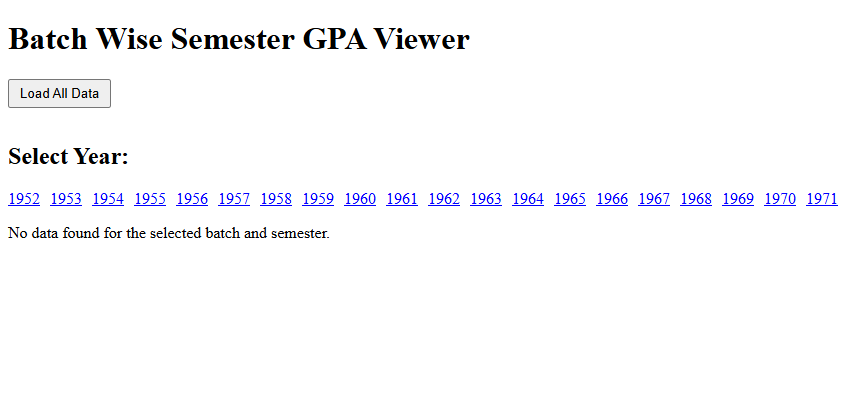
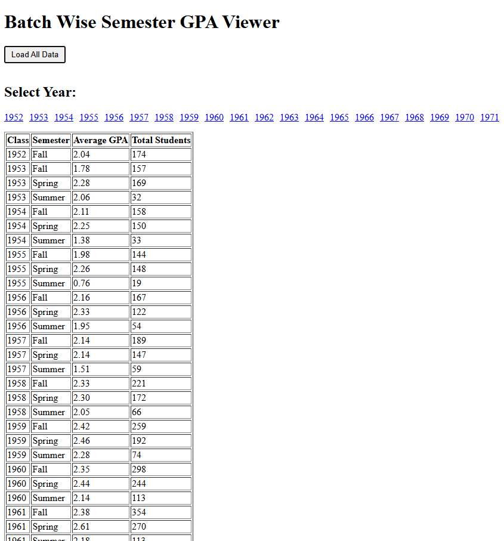
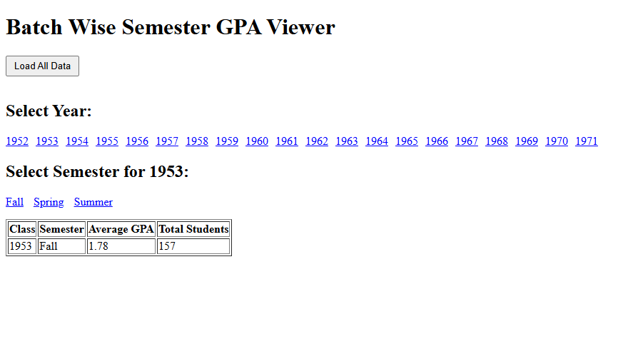
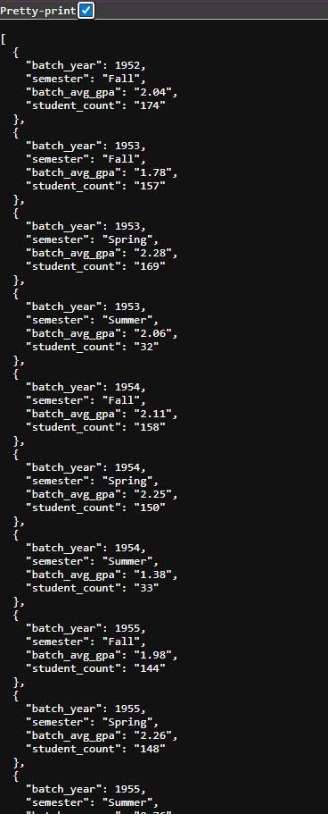

# 📊 University DBMS GPA Dashboard  

A full-stack university coursework project that computes and visualizes **batch-wise semester GPA** from a normalized university database.  

The system integrates a PostgreSQL database with a Node.js + Express backend and a lightweight frontend built using HTML/CSS and Alpine.js.  

---

## 👨‍💻 Created By  
- **Umer**  

**Course:** *Database Management Systems (DBMS)*  

---

## ✨ Features  
- 📂 **Normalized Database Design** with multiple entities (Student, Faculty, Course, Grades, Marks, Distributions).  
- 🧮 **Batch-wise Semester GPA Calculation** using SQL logic with weighted major & continuous assessments.  
- 🔗 **Express API** with a clean endpoint: `GET /batch-gpa`.  
- 🌐 **Frontend Dashboard** built with Alpine.js (filters by year & semester).  
- 📊 **JSON API Response** – average GPA and student counts per class/semester.  
- 🔒 Environment variables handled securely with `.env` + `.env.example`.  
- 🚀 Deployed and tested online (Firebase Studio).  

---

## 🗄️ Database Concepts Used  
- **Relational Schema Design & Normalization** structured multiple entities (Student, Course, Faculty, Grades, Marks) into a clean schema.  
- **Joins & Aggregation** (GROUP BY, AVG, COUNT).  
- **Common Table Expressions (CTEs)** to combine marks and weights.  
- **Mapping Total Scores to GPA** using ranges in the Grade table.  

---

## 🛠️ Technologies Used  
- **Backend:** Node.js, Express  
- **Database:** PostgreSQL (Neon)  
- **Frontend:** HTML, CSS, Alpine.js  
- **Hosting/Deployment:** Firebase Studio (demo upload for review)  

---

## 📂 Project Structure  

```plaintext
public/              → Static frontend files (index.html, app.js, styles.css)
route/routes.js      → Express route definitions (/batch-gpa)
db.js                → Database connection (Postgres)
Script/EXAMS.sql     → Full schema + dataset
.env                 → Local environment variables (ignored)
.env.example         → Safe template with placeholders
.gitignore           → Git exclusions
main.js              → App entry point
README.md            → Project documentation
```

---

## ▶️ How to Run  

### 1. Clone Repo  
```bash
git clone https://github.com/uni-course-projects/dbms-gpa-dashboard.git
cd dbms-gpa-dashboard
```

### 2. Install Dependencies  
```bash
npm install
```

### 3. Setup Environment  
```bash
cp .env.example .env
# Fill in your own Neon/Postgres credentials
```

### 4. Run Server  
```bash
node main.js
```

### 5. Access in Browser  
- Frontend: [http://localhost:3000](http://localhost:3000)  
- API: [http://localhost:3000/batch-gpa](http://localhost:3000/batch-gpa)  

---

## 📡 Sample API Response  

`GET /batch-gpa?year=1952&semester=Fall`  

```json
[
  {
    "batch_year": 1952,
    "semester": "Fall",
    "batch_avg_gpa": "2.04",
    "student_count": 174
  },
  {
    "batch_year": 1953,
    "semester": "Spring",
    "batch_avg_gpa": "2.28",
    "student_count": 169
  }
]
```

---

## 📸 Screenshots  

### Dashboard UI – Year/Semester Filter View  
  

### Load All Data  
  

### Specific Year and Semester  
  

### Sample JSON Output – from `/batch-gpa`  
  


---

## 📚 What I Learned  
- Writing SQL queries with joins, aggregations, and CTEs for GPA calculation.  
- Integrating a database with a Node.js + Express API.  
- Handling environment variables securely with `.env` files.  
- Building a minimal frontend to consume and display API data.  
- Deploying and testing the project on a hosted environment (Firebase Studio).  

---

## 🔮 Future Improvements  
- Switch `db.js` from a single `Client` connection to a `pg.Pool` for better scalability.  
- Add `express.json()` middleware for POST/PUT APIs (already supported but unused).  
- Add `helmet` middleware for security headers in production.  
- Replace hardcoded year range with a `/years` API endpoint (fetched from DB).  
- Create database indexes aligned with GPA queries.  
- Improve UI with charts/graphs (GPA trends per semester).  
- Record a short demo video and embed in README.  

---

## 🏁 Conclusion  
This project showcases how database concepts can be applied in practice, from schema design and query formulation to API integration and frontend visualization. It demonstrates not only SQL logic but also how to package a complete working system for academic and portfolio purposes.  
